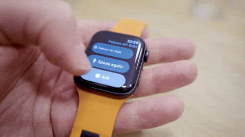

<p align="center">
  
</p>

<h1 align="center">A language model on an Apple Watch</h1>

<p align="center">
  Offline LLM inference on a six-year-old Apple Watch Series 6.<br>
  Upstream llama.cpp, cross-compiled for watchOS.
</p>

<p align="center">
  
</p>

---

A watchOS app that runs a small quantized language model fully on-device,
streams tokens to the screen, and reports live benchmark stats.

Inference is **upstream llama.cpp**, cross-compiled for watchOS's `arm64_32`
ABI. Two build flags are all it takes to get it working — plus a one-line CMake
fix, without which ggml silently compiles its scalar fallback kernels and throws
away the entire NEON path. See
[docs/LLAMACPP_ON_WATCHOS.md](docs/LLAMACPP_ON_WATCHOS.md).

```
WatchLLM/                  the watchOS SwiftUI app
  LlamaCppEngine.swift     thin Swift wrapper over llama.h
  LLMRunner.swift          drives it, publishes UI state
  Tools/Tools.swift        declarative web tools
  Tools/Tools.json         tool config — git-ignored
vendor/llamacpp/           prebuilt static libs (device + simulator) + headers
tools/                     model fetch, llama.cpp build, GGUF + tool testers
```

## Quick start

```bash
brew install xcodegen       # the Xcode project is generated, not committed
./tools/fetch_model.sh      # ~59 MB + ~105 MB from Hugging Face
make project                # generates WatchLLM.xcodeproj
open WatchLLM.xcodeproj     # select your paired Watch and Run
```

First time on a Mac that has never built for watchOS — the SDK being present is
not enough, the platform components are a separate download:

```bash
xcodebuild -downloadPlatform watchOS     # ~4 GB, once
```

The llama.cpp static libraries are committed, so you don't need to build them.
To regenerate them (or bump the llama.cpp version):

```bash
./tools/build_llamacpp.sh                # clones, patches, builds, stages
```

## What it runs

Two models, switchable in the app, both plain GGUF:

| model | size | notes |
|---|---|---|
| [Falcon-H1-Tiny-90M-Instruct](https://huggingface.co/tiiuae/Falcon-H1-Tiny-90M-Instruct) | 57 MB | hybrid Mamba-2 + attention |
| [SmolLM2-135M-Instruct](https://huggingface.co/HuggingFaceTB/SmolLM2-135M-Instruct) | 104 MB | Llama architecture |

## Web tools

Four keyless tools (weather, Bitcoin, USD→EUR, Wikipedia). A tool runs
**before** generation and its result is folded into the prompt, so the model
itself never touches the network.

Tool definitions live in `WatchLLM/Tools/Tools.json`, which is git-ignored.
With no such file the app has zero tools and is fully offline. Test a config
without rebuilding:

```bash
./tools/test_tool.py "what is bitcoin trading at"
```

## Docs

- [docs/LLAMACPP_ON_WATCHOS.md](docs/LLAMACPP_ON_WATCHOS.md) — how llama.cpp is
  built for watchOS, and the arch-detection bug that costs you all the NEON
- [docs/WALKTHROUGH.md](docs/WALKTHROUGH.md) — the whole build, start to finish,
  including everything that broke
